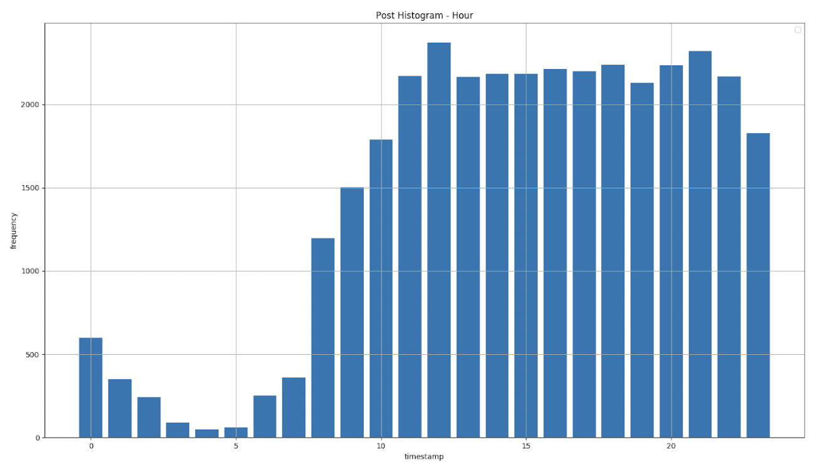
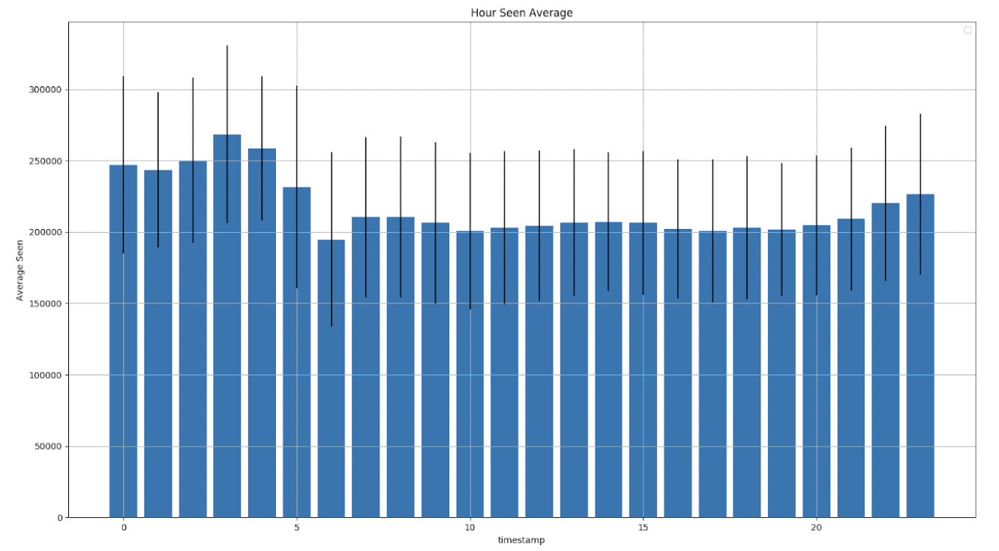
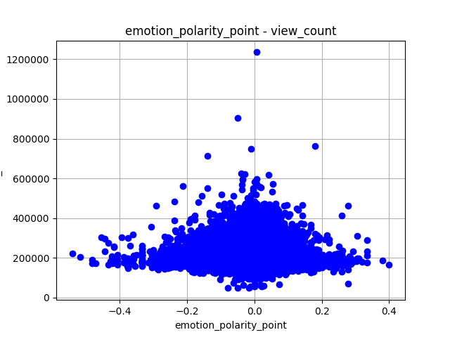
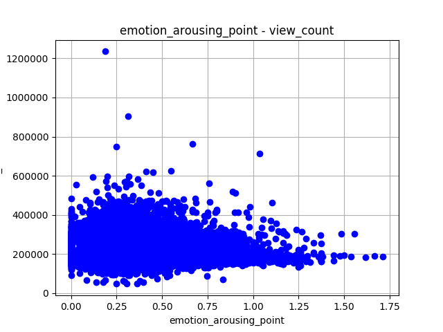

# cognitive-datamining-challenge
Cognitive analysis of social network impression using data mining techniques

# Description
In this project, we want to study the social network impression using the cognitive science theories and data mining techniques to answer the questions like:
- How do a post become popular in social networks?
- What are the key factors?
- How to make a post impressive?

# Data
We have crawled Telegram data of 5 popular news channels includeing AkharinKhabar, KhabarFori, ForiMohem, BBCPersian, AmadNews. These channels are the most popular channels in Iran having different political directions.

## Description
Each post includes the following properties:
- **ID**: a unique number
- **date**: publication date in Solar Date (Shamsi)
- **from**: name of news channel
- **time**: the time in which the post is shared in Tehran timestamp
- **media**: if the post contains multimedia
- **media_url**: link to multimedia content
- **text**: post textual contents
- **video**: if the post contains video
- **replied_to**: ID of the post replied to

## Distribution
Channel | Count 
--- | ---
AkharinKhabar | 8019
AmadNews | 5694
BBCPersian | 4926
KhabarFori | 6754
ForiMohem | 9791

# Results
Histogram of posts

Histogram of views

Polarity of posts

Arousing of posts

More results will be added soon!

# Acknowledgements
Hossein Basafa (hossein.basafa.hb@gmail.com)
Zahra Razavi
Mohammad Rahbari
Zahra Nouri

# Citation
Please site this repo and star to support further research in this field.
